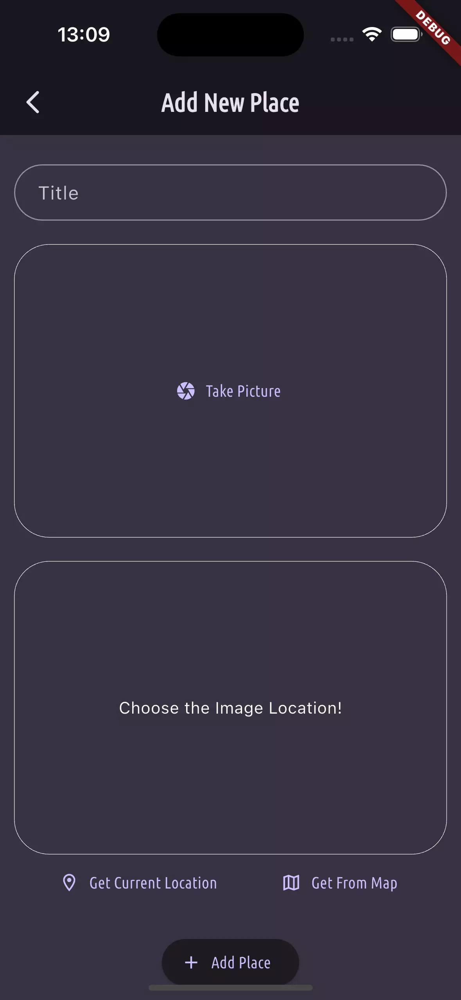
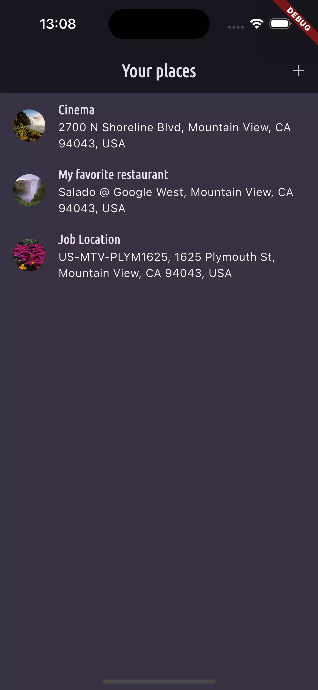
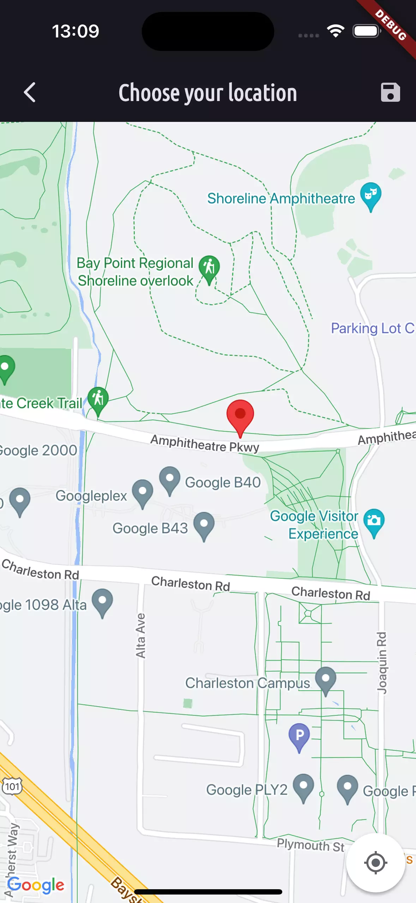

# Favorite Place App (Flutter)

## About
Multi-platform chat application built with **Flutter**. This Mobile App utilizes a wide range of features, including **Provider/Riverpod**, **Google Maps**, **Photo/Camera**, **SQLite**, and more.

Here you can add your favorite places, with image, location and save it on the device's db.

  

## Note
This is just an exercise and not a real publishable app.